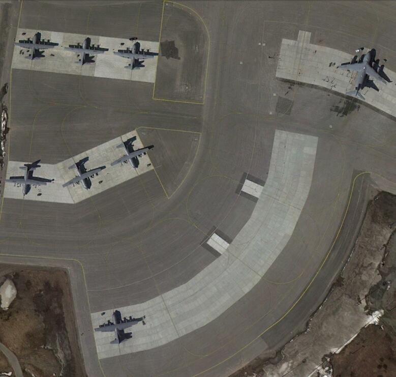
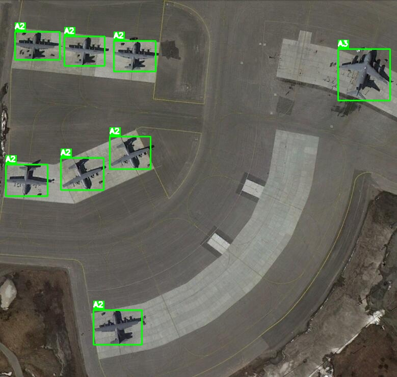
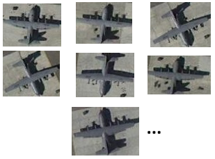
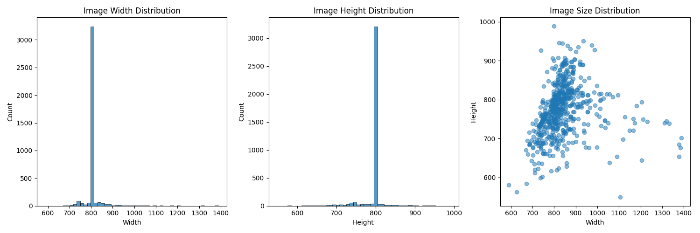
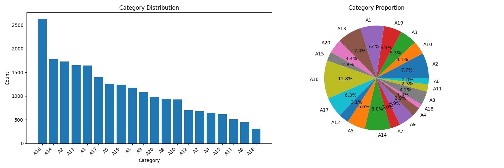
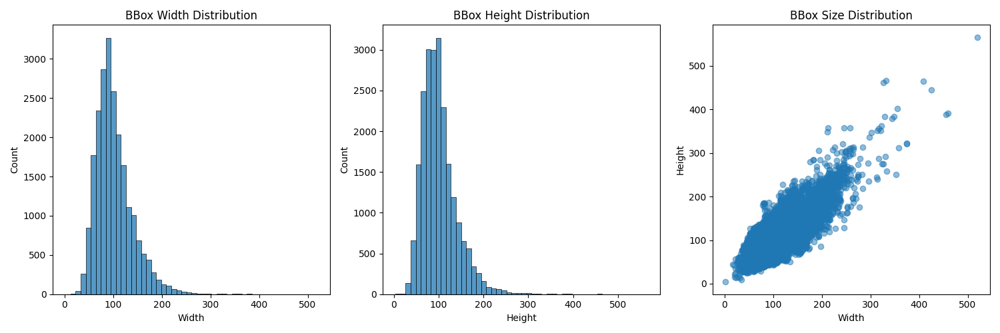
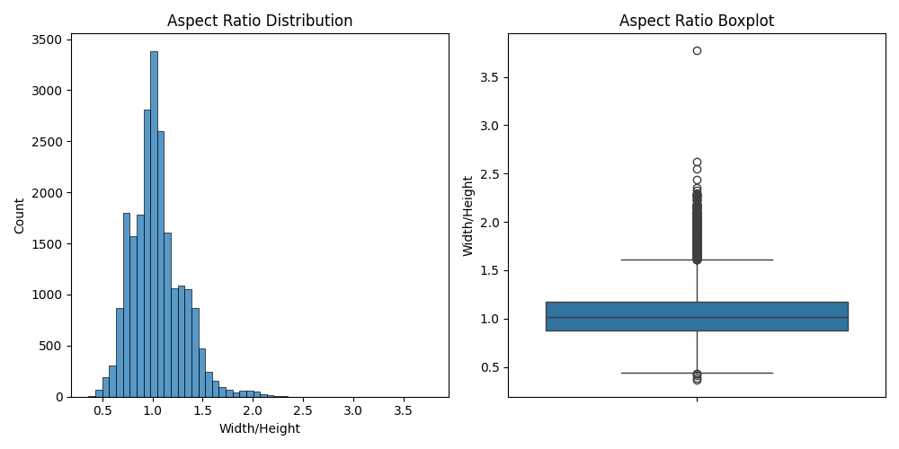
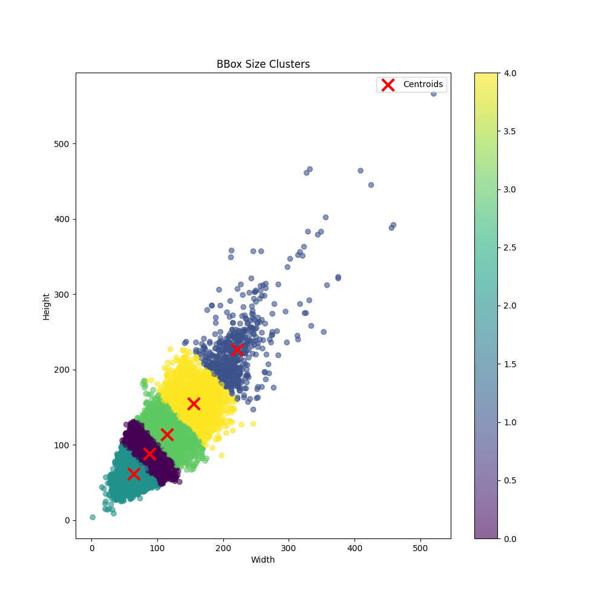

# Dataset Tools

一个功能强大的数据集处理工具库，支持目标检测数据集的格式转换、可视化和处理。支持水平框(HBB)和旋转框(OBB)两种类型的数据集。

## ✨ 主要特性

- 🔄 多格式转换：支持主流数据集格式的互相转换
- 👁️ 可视化工具：支持数据集的可视化和标注检查
- ✂️ 目标剪切：支持将目标区域剪切并按类别整理
- 🚀 高性能：多线程并行处理，显著提升处理速度
- 📊 进度监控：实时显示处理进度和详细统计
- 🖼️ 格式支持：支持多种图片格式 (jpg/jpeg/png/tif/tiff)

## 🔧 安装

```bash
pip install dataset-tools
```

## 📚 功能模块

### 1. 水平框处理 (HBB)

支持的格式：
- COCO (.json)
- VOC (.xml)
- YOLO (.txt)

<!-- #### 功能展示 -->

<!-- | 功能 | 输入 | 输出 |
|:---:|:---:|:---:|
| 可视化 |  |  |
| 目标剪切 |  |  |
| 格式转换 |  | -->

```python
from dataset_tools.hbb import HBBDatasetConverter, HBBDatasetVisualizer, HBBDatasetCropper

# 格式转换
converter = HBBDatasetConverter()
converter.convert(
    source_dir="datasets/yolo",
    source_format="yolo",
    target_format="coco",
    output_path="output/annotations.json",
    classes_file="datasets/classes.txt"
)

# 数据集可视化
visualizer = HBBDatasetVisualizer()
visualizer.set_class_names(['person', 'car', 'dog'])
visualizer.visualize(
    image_path='datasets/images',
    label_path='datasets/labels',
    format='yolo',
    output_dir='output/vis'
)

# 目标剪切
cropper = HBBDatasetCropper()
cropper.crop(
    image_path='datasets/images',
    label_path='datasets/labels',
    output_dir='output/crops',
    format='yolo',
    classes_file='datasets/classes.txt'
)
```

### 2. 旋转框处理 (OBB)

支持的格式：
- DOTA (.txt)
- 旋转COCO (.json)

<!-- #### 功能展示

| 功能 | 输入 | 输出 |
|:---:|:---:|:---:|
| 可视化 |  |  |
| 目标剪切 |  |  |
| 格式转换 |  | -->

```python
from dataset_tools.obb import OBBDatasetConverter, OBBDatasetVisualizer, OBBDatasetCropper

# DOTA转COCO
converter = OBBDatasetConverter()
converter.set_categories(['plane', 'ship', 'storage-tank'])
converter.dota_to_coco(
    dota_dir='datasets/dota',
    output_path='output/annotations.json'
)

# 可视化旋转框
visualizer = OBBDatasetVisualizer()
visualizer.set_class_names(['plane', 'ship', 'storage-tank'])
visualizer.visualize(
    image_path='datasets/images',
    label_path='datasets/labelTxt',
    format='dota',
    output_dir='output/vis'
)

# 剪切旋转目标
cropper = OBBDatasetCropper()
cropper.crop(
    image_path='datasets/images',
    label_path='datasets/labelTxt',
    output_dir='output/crops',
    format='dota'
)
```

### 输出目录结构

```
output/
├── crops/                    # 剪切结果
│   ├── person/              # 按类别整理
│   │   ├── img1_100_200_300_400.jpg
│   │   └── img2_150_250_350_450.jpg
│   └── car/
│       └── img1_200_300_400_500.jpg
├── visualization/           # 可视化结果
│   ├── hbb/
│   │   ├── img1.jpg
│   │   └── img2.jpg
│   └── obb/
│       ├── img1.jpg
│       └── img2.jpg
└── converted/              # 格式转换结果
    ├── coco/
    │   └── annotations.json
    ├── voc/
    │   └── *.xml
    └── yolo/
        ├── classes.txt
        └── *.txt
```

## 📋 数据集格式要求

### COCO格式
```json
{
    "images": [{"id": 1, "file_name": "xxx.jpg", ...}],
    "annotations": [{"id": 1, "image_id": 1, "category_id": 1, "bbox": [x,y,w,h], ...}],
    "categories": [{"id": 1, "name": "person", ...}]
}
```

### YOLO格式
```
# classes.txt
person
car
dog

# label.txt (每行: class_id x_center y_center width height)
0 0.5 0.5 0.2 0.3
```

### DOTA格式
```
# labelTxt/*.txt
x1 y1 x2 y2 x3 y3 x4 y4 category difficulty
```

## 🚀 未来计划

### 近期计划
- [ ] 支持 YOLO 旋转框格式
- [ ] 数据集分割功能 (训练/验证/测试集)
- [ ] 标注文件检查和修复
- [ ] 数据增强功能

### 长期计划
- [ ] 支持更多数据集格式 (KITTI等)
- [ ] 图形用户界面 (GUI)
- [ ] 实例分割数据集支持
- [ ] 数据集统计分析
- [ ] 关键点检测支持
- [ ] 数据集清洗工具

## 📝 更新日志

### v0.1.0
- 实现基础的格式转换功能
- 添加数据集可视化工具
- 添加目标区域剪切功能
- 支持多线程处理

## 🤝 贡献

欢迎提交 Issue 和 Pull Request！

## 📄 许可证

本项目采用 MIT 许可证。详见 [LICENSE](LICENSE) 文件。

## 📸 效果展示

### 目标检测可视化效果

| 类型 | 原图 | 可视化结果 |
|:---:|:---:|:---:|
| 水平框(HBB) |  |  |
<!-- | 旋转框(OBB) |  |  | -->

### 目标剪切结果

| 类型 | 原图 | 剪切示例 |
|:---:|:---:|:---:|
| 水平框(HBB) |  |  |
<!-- | 旋转框(OBB) |  |  | -->

### 数据集统计结果(以MAR20数据集为例)
| 类型 | 结果 |
|:---:|:---:|
| 图像尺寸 |  |
| 类别分布 |  |
| BBOX尺寸 |  |
| BBOX宽高比 |  |
| BBOX聚类 |  |

最终统计结果JSON文件
```json
{
  "image_count": 3842,
  "bbox_count": 22341,
  "category_count": 20,
  "image_size": {
    "width": {
      "min": 590,
      "max": 1389,
      "mean": 805.0028630921395
    },
    "height": {
      "min": 549,
      "max": 989,
      "mean": 794.7824049973972
    }
  },
  "bbox_size": {
    "width": {
      "min": 2.0,
      "max": 520.0,
      "mean": 101.67740924757173
    },
    "height": {
      "min": 4.0,
      "max": 566.0,
      "mean": 100.87780314220491
    }
  },
  "aspect_ratio": {
    "min": 0.36363636363636365,
    "max": 3.7777777777777777,
    "mean": 1.0415244429032822
  },
  "categories": {
    "A2": 1729,
    "A10": 924,
    "A3": 1176,
    "A19": 1236,
    "A1": 1646,
    "A13": 1652,
    "A20": 981,
    "A15": 618,
    "A16": 2632,
    "A17": 1397,
    "A12": 702,
    "A5": 1262,
    "A14": 1778,
    "A7": 680,
    "A9": 1086,
    "A4": 642,
    "A18": 308,
    "A8": 944,
    "A11": 507,
    "A6": 441
  }
}
```